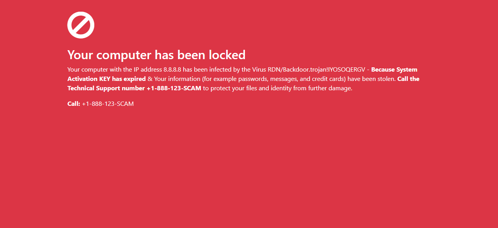

# Scambait website
This is a simple HTML page to present scammers with when scambaiting and reverse-scamming. It's a replica of sites actually used to fool people and serves as proof that there is a legitimate reason to call scammers. 

## Setup
1. Make sure to keep yourself safe (VPN+VM)!
1. Reroute e.g. `google.com` to 127.0.0.1 by using your host's `hosts` file.
1. Open the JavaScript console of the VM's webbrowser.
1. Open `google.com` using your VM. The interstitial website should appear.
1. Run `localStorage.setItem("scam_ipaddress", "123.123.123.123")` whereas you insert the network adapter's IP address.
1. Run `localStorage.setItem("scam_phonenumber", "+1-888-123-SCAM")` whereas you insert the the scammer's number that you are about to call.
1. The website should re-appear with the correct data. Now you're ready to start scambaiting.

## Downsides
- can be used ón any domain but the settings will have to be set per domain
- upcoming security features might make it more difficult to present this page

### Disclaimer
You're liable for everything you do. Staying safe is a requirement when scambaiting and also your sole responsability. Any malicious use is not intended.
